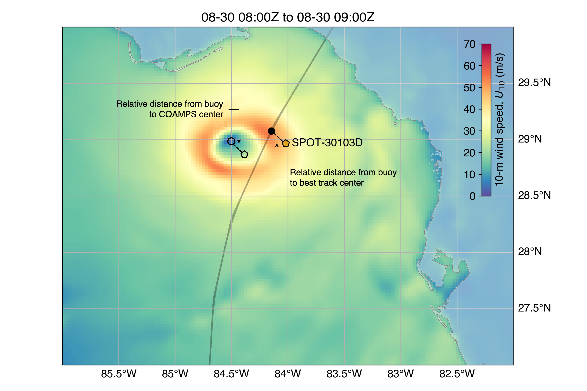

# coamps-tc-translation-demo

The aggregated COAMPS-TC forecasts occasionally deviate from the best track, assumed here to be the "truth", which can result in errors when querying positions (e.g., buoy locations) close to the center of the storm.  For example, in the image below, the buoy (yellow pentagon) is towards the outside of the high wind speed region of the storm relative to the COAMPS-TC fields (color scale), however, relative to the best track at this time (black dot), the buoy is near the eye.  This error will propagate when extracting wind speeds from COAMPS at the buoy's location in absolute lon-lat coordinates.  

<figure>
    
</figure>

Here I demonstrate a possible solution which determines the buoy's position relative to the storm's center on the best track, and then "shifts" the buoy relative to the COAMPS-TC center.
